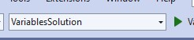

# Visual Studio

## Overview

Get acquainted with Visual Studio projects.

| | |
| --- | ----- |
| Exercise Folder | VisualStudio 
| Builds On | None 
| Time to complete | 30 minutes


The instructor will guide you along creating and running a new application in both Visual Studio and VS Code.  Then, you can explore on your own!

---

### Visual Studio
1. Open Visual Studio
2. Create a new project 
3. Select the Console Application template 
4. Click Next
5. Name the project "HelloIntro" 
   1. Change the location if desired
   2. Change the solution name to *Labs*
6. Click *Next*
7. Choose *.NET 9.0* as the target framework
   1. if you don't see *.NET 9.0* in the list, cancel and see the instructions for installing the .NET 9.0 SDK below.
8. Click *Create*

### VS Code
1. Open VS Code
2. Open a folder where you want to create your project
3. Open a terminal window in VS Code
4. Create a new console application using the .NET CLI
   1. `dotnet new console -o HelloIntro`
   2. `-o` specifies the output directory
5. There are several ways to run a project in VS Code
   1. `dotnet run` from the terminal window
   2. `dotnet run` from the VS Code command palette
   3. `F5` to run the project in debug mode
   4. `Ctrl+F5` to run the project without debugging
   5. In the solution explorer, right-click the project and select *Run* or *Debug*  

### On your own:
1. Create a new C# Console application
2. Change the "Hello World" text to any other content
3. Run the application in VS
4. Locate the output directory for your program
5. Open a console window (cmd) in that folder
6. Execute the program from the command shell


### Installing the .NET 9.0 SDK
1. Open a browser and navigate to https://dotnet.microsoft.com/download/dotnet/9.0
2. Follow the instructions to install the SDK on your platform.

# Types

## Overview

Understanding primitive data types.

| | |
| --- | ----- |
| Exercise Folder | Types 
| Builds On | None 
| Time to complete | 30 minutes

### Steps
1. Create a new console application named `Types`.
2. Open the `Program.cs` file.
3. Using the sample code below, create lines of code that help you understand the different primitive data types in C#.

```csharp
// The most basic data type is a byte. It is an 8-bit unsigned integer. 
// It can store values from 0 to 255.

byte a = 199;

// display the value of a in decimal, octal, hexadecimal and binary format
Console.WriteLine(a); // 255
Console.WriteLine(Convert.ToString(a, 8)); // 377
Console.WriteLine(Convert.ToString(a, 16)); // ff
Console.WriteLine(Convert.ToString(a, 2)); // 11111111

Console.WriteLine("-------------------");

// A signed byte uses the same amount of memory as an unsigned byte.
// The only difference is that it can store values from -128 to 127.
sbyte b = -20;
Console.WriteLine(Convert.ToString(b, 2)); // -1
Console.WriteLine("Notice the top bit is 1, which indicates a negative number");    

Console.WriteLine("-------------------");
// integers are whole numbers that can be positive, negative, or zero.
int c = 100;
// display the value of c in decimal, octal, hexadecimal and binary format
Console.WriteLine("int c = 100;");
Console.WriteLine(c); // 100
Console.WriteLine(Convert.ToString(c, 8)); // 144
Console.WriteLine(Convert.ToString(c, 16)); // 64
Console.WriteLine(Convert.ToString(c, 2)); // 1100100

// write to the console the maximum and minimum values of short, int, long
Console.WriteLine("-------------------");
Console.WriteLine("short: {0} to {1}", short.MinValue, short.MaxValue);
Console.WriteLine("int: {0} to {1}", int.MinValue, int.MaxValue);
Console.WriteLine("uint: {0} to {1}", uint.MinValue, uint.MaxValue);
Console.WriteLine("long: {0} to {1}", long.MinValue, long.MaxValue);

// floating point numbers are numbers that have a fractional part.
// float is a 32-bit floating point number.
Console.WriteLine("-------------------");
float d = 3.14f;
Console.WriteLine(d);

// double is a 64-bit floating point number.
Console.WriteLine("-------------------");
double e = 3.14;
Console.WriteLine(e);

// decimal is a 128-bit floating point number.
Console.WriteLine("-------------------");
decimal f = 3.14m;
Console.WriteLine(f);

// show the min and max values of float, double, decimal
Console.WriteLine("-------------------");
Console.WriteLine("float: {0} to {1}", float.MinValue, float.MaxValue);
Console.WriteLine("double: {0} to {1}", double.MinValue, double.MaxValue);
Console.WriteLine("decimal: {0} to {1}", decimal.MinValue, decimal.MaxValue);

// char is a 16-bit Unicode character.
Console.WriteLine("-------------------");
char g = 'A';
Console.WriteLine(g);

// show g as integer
Console.WriteLine((int)g);
// show g as binary
Console.WriteLine(Convert.ToString(g, 2));

// string is a sequence of characters.
Console.WriteLine("-------------------");
string h = "Hello, World!";
Console.WriteLine(h);
```

# Syntax


## Overview
This lab demostrates the basic syntax of C# by declaring and initializing variables of different types.

| | |
| --------- | --------------------------- |
| Exercise Folder | Syntax |
| Builds On | None |
| Time to complete | 30 minutes

---
## Instructions
1. Either create a new console application in your current solution or continue with your last project
1. In *Program.cs*, Declare variables of these types:
    - int, uint, long
    - float, double
    - char, bool
1. Initialize the variables with literals
1. Using interpolated strings ($"") and ```Console.WriteLine```, display the variable's values

### Example
```csharp
// Symbox syntax
// A symbol consists of any number of letters, digits, or underscores, 
// but must start with a letter or underscore.
// Also, case-sensitive.
int myvariable;
// is different from
int MyVariable;
//int 9lives; // invalid

// declaring (or defining) a variable is
// type name;
int myInt;
// cannot have duplicate declarations
//int myInt; <-- invalid, already declared

// assignment vs initialization

// assignment - giving a variable a value after it is declared
myInt = 5;
// initialization - giving a variable a value when it is declared
int myInt2 = 5;

// type strictness
// once a variable is declared with a type, it cannot be changed
//myInt = "hello"; // invalid - myInt is an int, not a string

// variables can be reassigned
myInt = 10; // previously 5

// literal values
// a literal value is a value that is written directly in the code
// 5 is a literal value
// "hello" is a literal value

// notation for literal types
// 5 is an int
// 5.0 is a double
// 5f is a float
// 5L is a long
// 5u is a uint
// 5m is a decimal

int wholeNum = -20;
long bigNum = 22_678_123; // underscores are ignored, used for readability
uint positive = 223;
var pif = 3.14f;
double pid = 3.141567896;
//decimal money = 0;

// char is a single character - literals are in single quotes
char c = 'c';
// string is a sequence of characters - literals are in double quotes
string text = "This is a string";

Console.WriteLine($@"I wrote a program in C# and here is some data:
wholeNum: {wholeNum},
bigNum: {bigNum},
positive: {positive},
pif: {pif},
pid: {pid},
c: {c},
and text: {text}.
Have a nice day!");

Console.WriteLine($"""
   Oh, and here is the same thing, but with a raw string:
   wholeNum: {wholeNum},
   bigNum: {bigNum},
   positive: {positive},
   pif: {pif},
   pid: {pid},
   c: {c},
   and text: {text}.
   Have a nice day!
   """);

// Console is a class in the System namespace
// WriteLine is a method in the Console class
// WriteLine writes a line of text to the console
// $ is an interpolated string
// {} is a placeholder for a variable
// \n is a newline character
// \t is a tab character
// if the parameter is not a string, it is converted to a string
Console.WriteLine($"Hello, World! {wholeNum} (extra newline)\n");
```

 
 >Note (Visual Studio):  If your solution has multiple projects, the *startup project* will execute when you run.  To select the startup project, look a the dropdown list in the toolbar:
 
 ---

>Note (VS Code): The *C# Dev Kit* extension has a feature that will run the current project.  To use it, right-click on the project in the *Solution Explorer* and select *Run Project* from the context menu.  
 


# Operators

## Overview
In this lab, we will perform temperature conversions.

| | |
| --------- | --------------------------- |
| Exercise Folder | Operators |
| Builds On | None |
| Time to complete | 20 minutes

## Steps

1. Either create a new console project, or continue with your current project.
2. Declare a variable to hold a Fahrenheit value
3. Declare a variable to hold Celsius
4. Declare a variable to hold Kelvin

- K =  C +  274.15 
- F = C X 9/5 + 32
- C = 5/9(F-32)

5. Pick a value for F and convert to C and K
6. Pick a different value and repeat
7. Convert several F,C, and K values to the other scales and display.

---


# While Loops

## Overview
In this lab, we generate a table of temperatures.

| | |
| --------- | --------------------------- |
| Exercise Folder | WhileLoop |
| Builds On | Operators |
| Time to complete | 20 minutes

## Steps

- Building on the previous lab, create a while loop that iterates from -40F to 212F
displaying the F, C, and K temperatures 

---


# For Loops

## Overview
In this lab, we generate a table of temperatures.

| | |
| --------- | --------------------------- |
| Exercise Folder | ForLoop |
| Builds On | WhileLoop | 
| Time to complete | 10 minutes


- Convert the **while** to a **for** in the previous lab.

1. Delete or comment out the declaration of `F` and any other variables that are not needed.
1. Delete or comment out the `while` statement.
1. Replace the `while` with a `for` statement.
    * `for (init; condition; increment)`
1. Remove the increment statement at the bottom of the loop

- Challenge: *Convert only even F temperatures*

---


# Conditionals

## Overview
In this lab, we generate a table of temperatures.

| | |
| --------- | --------------------------- |
| Exercise Folder | Conditionals |
| Builds On | For Loop |
| Time to complete | 10 minutes

- Certain temperatures are dangerous
- Notify the user by displaying a ^ to indicate that it is hot if the temperature is above 130F
- Display an * at the start of the line for temperatures below 20F

 --- 
 
 *If you need a hint - check it out:*
 ```C#
for (double F = -40; F <= 212; F+=2)
{
    double C = 5.0f / 9.0f * (F - 32);
    double K = C + 274.15;
    if (F <= 20) Console.Write('*');
    else if (F > 130) Console.Write('^');
    Console.WriteLine($"{F}\t{C}\t{K}");
}
 ```
 
 ### Want More?
 <iframe width="560" height="315" src="https://www.youtube.com/embed/KA7HA7b6a68?si=bIwsgzeJhzrB-low" title="YouTube video player" frameborder="0" allow="accelerometer; autoplay; clipboard-write; encrypted-media; gyroscope; picture-in-picture; web-share" allowfullscreen></iframe>
 
 [youtube.com](labs/Conditionals/https://youtu.be/KA7HA7b6a68)

# Loops

## Overview
What can we do with loops? 

| | |
| --------- | --------------------------- |
| Exercise Folder | Loops |
| Builds On | None |
| Time to complete | 20 minutes

- Create a new console project.  In *Program.cs*, try these loops:

### Fibonacci Series
We can use a loop to calculate Fibonacci numbers.

```csharp
// Create a for loop to produce fibonacci series
// The first two numbers in the Fibonacci sequence are 0 and 1, 
// and each subsequent number is the sum of the previous two.
int n = 10;
int a = 0;
int b = 1;
int c = 0;
Console.WriteLine("Fibonacci series:");
for (int i = 0; i < n; i++)
{
    Console.WriteLine(a);
    c = a + b;
    a = b;
    b = c;
}
```

### Calculate Pi
We can use a loop to calculate Pi using the Leibniz formula.

```csharp
// Calculate PI using the Leibniz formula
// PI = 4/1 - 4/3 + 4/5 - 4/7 + 4/9 - 4/11 + ...
int max = 1000000;
double pi = 0;
for (int i = 0; i < max; i++)
{
    pi += 4.0 / (2 * i + 1) * (i % 2 == 0 ? 1 : -1);
}
Console.WriteLine($"PI is approximately {pi}");
```

### Prime Numbers
We can use a nested loop to find prime numbers.

```csharp
// Find the first 20 prime numbers
// A prime number is a number that is greater than 1 and is only 
// divisible by 1 and itself.
// The first prime number is 2.
// We find prime numbers by checking if a number is divisible by any
// number less than its square root.
Console.WriteLine("First 100 prime numbers:");
int count = 0;
int num = 2;
while (count < 100)  // loop until we find 100 prime numbers
{
    bool isPrime = true;
    // num is the candidate prime number
    // go from 2 to the square root of num 
    // if num is divisible by any number, it is not prime
    // stop checking when we find a divisor
    for (int i = 2; i <= Math.Sqrt(num); i++)
    {
        if (num % i == 0)
        {
            isPrime = false;
            break;
        }
    }
    if (isPrime)
    {
        Console.WriteLine(num);
        count++;
    }
    num++;  // check the next number
}
```

# Arrays

## Overview 
In this lab, we will convert selected temperatures stored in an array.

| | |
| --------- | --------------------------- |
| Exercise Folder | Arrays |
| Builds On | Conditionals |
| Time to complete | 20 minutes

- Building on the previous lab, define an array of temperatures as shown:
 
 ```double[] ftemps = { -40, 0, 20, 32, 55, 72, 90, 100, 110, 212 };```

- Use a ```foreach``` loop to convert only the temps in the array.

--- 


# Strings and Console

## Overview
Get temperatures from the user

| | |
| --------- | --------------------------- |
| Exercise Folder | StringConsole |
| Builds On | Arrays |
| Time to complete | 30 minutes 

Prompt the user for a temperature then display converted values.

### Steps
1. Define a ```bool done``` variable, initially set to false
1. Modify the loop to a ```while(!done)```
1. Inside the loop, prompt the user to enter a temperature
1. If the user enters non-blank
    1. Convert the string temperature to a number with ```double.ParseDouble(text)```
    1. Display the C and K values 
1. Else if the user doesn't enter anything, set done to ```true```

> Note - you may see *warnings* about null references.  Please disregard

---


### Want More?
[youtube.com](labs/StringsConsole/https://youtu.be/XJnC8bg9nBY)


# BubbleSort

## Overview

Let's sort an array of strings!

| | |
| --------- | --------------------------- |
| Exercise Folder | BubbleSort |
| Builds On | None |
| Time to complete | 60 minutes

Apply what you learned about sorting to sort an array of strings.

### Setup
* Create a new console project and copy and paste the code below into your main file.
* The array *names* is initialized with some random names.  We used an array initializer to do this.  The compiler will figure out the size of the array.
* Each element of the array is of type *string*.
* Use a `foreach` loop to print out the original contents of the array.

```c#
// some names to sort
string[] names = {
		"Hill, Hank",
		"Hill, Peggy",
		"Platter, Luanne",
		"Platter, Lucky",
		"Strickland, Buck",
		"Souphanousinphone, Minh",
		"Boomhauer, Jeff",
		"Gribble, Dale",
		"Gribble, Nancy",
		"Souphanousinphone, Kahn",
		"Dauterive, Bill",
		"Dauterive, Lenore",
		"Redcorn, John",
		"Souphanousinphone, Connie"
	};

// display the array
Console.WriteLine("Unsorted array:");
foreach (string name in names)
    Console.WriteLine(name);```
```

### Steps

1. declare a variable to hold the number of elements in the array - 1.  This will be the number of times we need to iterate through the array (at most).  Name the variable *maxIndex*
1. declare a boolean variable to indicate if a swap was made during the last iteration.  Initialize it to true.  Name the variable *swapped*.
1. use a while for the outer loop.  Loop until *swapped* is false.
1. Inside the while loop, 
	* set *swapped* to false.
	* declare a temporary variable *lastswapped* and set it to 1.
* Now, use a for loop to iterate through the array.  The loop should start at 0 and end at < *maxIndex*.
	* if the array has length 20, the last index is 19.  That's what maxIndex starts with.  The loop should stop at 18 because we will compare the current index with the next index (19).
* In the for loop, compare the current element with the next element.  If the current element is greater than the next element
	* swap them (use a temporary variable)
	* set *swapped* to true.
	* set *maxIndex* to the current index.  This will reduce the number of times we need to iterate through the array.  At worst, *maxIndex* will be 1 smaller each time through the loop, but it could be more.

---

* Lastly, loop through the array and print out the sorted contents.

---
### Challenge
Declare a variable to hold the number of comparisons made during the sort.  Increment the variable each time you compare two elements.

Display the value of the variable after the sort is complete.  How many comparisons were made? How can that change with the input data and with the algorithm?

  * for instance, just decrementing maxIndex after each outer loop will result in more comparisons.  We counted 85 with a simple decrement vs 73 with tracking the last swapped index.
  * also, looping the outer loop until maxIndex is 0 will result in more comparisons.  We counted 91 with this approach.
	

You will notice that increasing the number of elements in the array just a little increases the number of comparisons a lot!


# References


## Overview
Experimenting with value and reference types helps with understanding them.

| | |
| --------- | --------------------------- |
| Exercise Folder | References |
| Builds On | None |
| Time to complete | 20 minutes 

---
## Instructions
1. Create a new console application in your current solution
1. Paste the code below over *Program.cs*
1. Make the project the startup project
1. Run the application
1. Explain why modifications to a & b don't impact the other, but changes to either ```vals``` or ```copy``` changes both.

---

### nullable types
The ```Console.ReadLine``` in this and the previous lab warned of a nullable type problem
What can be done to avoid the warning?

#### Starter code

```C#
int a = 5;
int b = a;

b++;

Console.WriteLine($"a is {a} and b is {b}");

float[] vals = { 1.618f, 3.14f, 8.15f };
float[] copy = vals;

Console.WriteLine("Content of vals array: ");
foreach (var v in vals) Console.WriteLine(v);
Console.WriteLine("Content of copy: ");
foreach (var v in copy) Console.WriteLine(v);

copy[2] = 5.1999f;
Console.WriteLine("-----------");
Console.WriteLine("Content of vals array: ");
foreach (var v in vals) Console.WriteLine(v);
Console.WriteLine("Content of copy: ");
foreach (var v in copy) Console.WriteLine(v);

// correct the warning on the following line
string text = Console.ReadLine();
Console.WriteLine("You entered: " + text);
```

### Want More?
[youtube.com](labs/References/https://youtu.be/5wCLsoLfEiw)


# Basic Methods

## Overview
In this lab, we create temperature conversion methods.

| | |
| --------- | --------------------------- |
| Exercise Folder | BasicMethods |
| Builds On | None |
| Time to complete | 45-60 minutes

---
## Instructions
1. Add a new console application to your solution - named *BasicMethods*
1. In *Program.cs* add the following method skeletons to the bottom of the file
```C#
double F2C (double f)
{
    return 0;
}
double F2K (double f)
{ 
    return 0; 
}
double C2F (double c)
{
    return 0;
}
double C2K (double c)
{
    return 0;
} 
```
- F2C returns the Celsius temp from a fahrenheit temp
- F2K returns the Kelvin temp from a farenheit temp
- you get the idea...
3. Reference the formulas you created in earlier exercises, complete the methods
3. Add code *above* these methods to call with various sample data and print the converted temps
	- in *top level code files* methods must be below all top level code
5. *Challenge* - use a loop to convert ranges of temperatures using the methods

---

### Extra Credit

Methods are used in real-world applications to perform a singular task and thus remove the need to duplicate code.  In these challenges, we will create some methods that perform some useful tasks.

### Recursion
A method that calls itself is called a recursive method.  Create a recursive method that calculates the factorial of a number.  The factorial of a number is the product of all positive integers less than or equal to the number.  For example, the factorial of 5 is 5 * 4 * 3 * 2 * 1 = 120.  The factorial of 0 is 1.  The factorial of a negative number is undefined.

##### Steps
1. Add a new method to the bottom of *Program.cs* named *Factorial*
1. The method should take an unsigned long integer parameter and return unsigned long
1. if the parameter is 0, return 1
1. otherwise, return the parameter times the result of calling *Factorial* with the parameter minus 1

Above the method in your top-level code, call the *Factorial* method with various values and print the results.
The number of unique decks of cards is 52 factorial.  This is an incredibly large number.  Try calculating the factorial of 52 and see what happens.  Compare the result to the number of atoms in the universe (google it).

---

### Prime Numbers

A prime number is a number that is only divisible by 1 and itself.  Write a method that determines if a number is prime.  The method should take an integer parameter and return a boolean.  The method should return true if the number is prime and false if it is not.

##### Steps

1. Add a new method to the bottom of *Program.cs* named *IsPrime*
1. The method should take an integer parameter and return a boolean
1. If the parameter is less than 2, return false
1. Loop from 2 to the square root of the parameter
    1. If the parameter is divisible by the loop variable, return false (hint: use the modulo operator)
1. Return true

Add some code to the top of the file that calls the *IsPrime* method with various values and prints the results.  Verify that it is accurate by checking the results against a list of prime and non-prime numbers.

#### Find Prime numbers
Next, create a method that returns an array of prime numbers.  We will pass in how many we want.

##### Steps
1. Add a new method to the bottom of *Program.cs* named *GetPrimes*
1. The method should take an integer parameter and return an array of integers
1. Inside the method, declare an array of integers to hold the prime numbers - size the array to the parameter
1. Create a variable to hold the number of primes found and set it to 0
1. Loop from 2 to the maximum integer value
    1. If the number is prime, add it to the array and increment the number of primes found
    1. If the number of primes found is equal to the parameter, break out of the loop
1. Return the array

Add some code to the top of the file that calls the *GetPrimes* method with various values and prints the results.  Verify that it is accurate by checking the results against a list of prime numbers.

# Method Parameters

## Overview
Fun with method parameters!

| | |
| --------- | --------------------------- |
| Exercise Folder | Method Parameters |
| Builds On | None |
| Time to complete | 60 minutes

---

In this exercise, you will demonstrate:
* methods with default parameters
* methods with variable length parameter lists
* overloaded methods
* out parameters
* ref parameters

> **Note:** C# does not allow overloaeded methods in *top-level* code.  So, for this lab, we will use the traditional *Program* class with a *Main* method.  In any application, you can use the *refactoring* lightbulb to convert a class with *main* into top-level code and vice-versa.  The C# compiler simply generates a class with a *Main* method for you when you use top-level code.

---

### Steps
1. Create a new console application named *MethodParameters*
1. Replace the contents of *Program.cs* with the following code:
```csharp
class Program
{
    static void Main(string[] args)
    {
    }
}
```
3. Add 2 methods named *Display* to the class as shown below:
```csharp
static void Display(string message){}
```
and 
```csharp
static void Display(int number){}

4. In the body of each method, use `Console.WriteLine` to display the parameter value as well as text that identifies the method.  
5. In the *Main* method, call each of the *Display* methods with a string and an integer parameter.  Observe that the correct method is called based on the parameter type.
6. Add another method named `Greet` as shown bellow:
```csharp
static void Greet(string name = "User"){}
```
7. In the body of the method, use `Console.WriteLine` to display the parameter value as well as text that identifies the method.
8. In the *Main* method, call the *Greet* method with no parameters and with a parameter. 
9. Add another method named `Sum` as shown bellow:
```csharp
static void Sum(params int[] numbers){}
```
10. In the body of the method, loop through the array of numbers and add them together.  Display the sum.
11. In the *Main* method, call the *Sum* method with different numbers of parameters.


### ref & out parameters

Create a method that can resize an existing array of integers and provide some statistical data about the array.

`static float Resize(int newSize, ref int[] array, out int total)`
* The method will allocate a new array of *newSize* and copy the contents of the existing array into the new array.
* Then, overwrite the array parameter with the new array.
* Calculate the total of the numbers in the array and return it in the *total* parameter.
* Calculate the average of the numbers and return that as the method's return value.

#### Steps
1. Add the *Resize* method to the *Program* class.  Implement the method as described above.  
  * note - cast either the numerator or denominator to a float to get a floating point result when calculating the average.
  * ie *return **(float)** total / array.Length;*
2. In the *Main* method, create an array of integers and initialize it with some values.
3. Call the *Resize* method and pass the array as a *ref* parameter.
4. Display the total and average of the numbers in the array.


# Structs


## Overview
Temperature is a little like a date.  Dates can be represented
as 2023-2-14 or Feb 14, 2023 and depending on your country, month and 
day can be switched around.  With temperature, some prefer Celsius,
some prefer Fahrenheit and some prefer kelvin.  Whatever your preference,
the temperature is the same, its really just how we express the temperature to
the human.

In this lab, we will create a new type called *Temperature*

| | |
| --------- | --------------------------- |
| Exercise Folder | Structs |
| Builds On | None |
| Time to complete | 45 minutes

---
## Instructions
1. Create a new console application in your current solution
1. Right click on the new project and choose *Add/Class*
    - name the class *Temperature*
1. Modify the source code to (change *internal class* to *public struct*)
    - note - you can ignore or delete the *usings* and *namespace*

```C#
public struct Temperature
{
}
```
3. Add a field to the struct - ```double temp;```
    - this will hold the temperature in whatever scale you choose
4. Create 3 properties:
```c#
public double Fahrenheit 
public double Celcius
public double Kelvin
```
5. For each property, the getter will return the temp, converting from whatever
you are storing the temp as
6. For each property, the setter will convert **value** from the property's scale
to whatever you are storing it as
6. Add a method named ```string Format()``` that returns a formatted
string containing all three scales
7. In *Program.cs*, write some top-level code to create temperature variables
and set and get different scales.
    - note - for reasons explained later, you will need to **new** your temperature objects

*example program.cs*
```C#
Temperature freezing = new Temperature();
freezing.Celcius = 0;

Temperature boiling = new();
boiling.Celcius = 100;

Temperature room = new(25);  //challenge

Console.WriteLine(freezing.Format());
Console.WriteLine(boiling.Format());
Console.WriteLine(room.Format());

```

*Challenge*  Add a constructor that accepts C temperature to initialize the object. 


# Enums

## Overview
In this lab, we will extend the *Temperature* lab by adding an enumeration to represent the various temp scales

| | |
| --------- | --------------------------- |
| Exercise Folder | Enum |
| Builds On | Struct |
| Time to complete | 15 minutes

---

### Steps
1. In *Temperature.cs* before **struct Temperature** define an enum named *TemperatureScale* with 3 values, *CELSIUS*, *FAHRENHEIT*, and *KELVIN*
2. Add another parameter to the *Temperature* constructor so that the scale can be passed.  Make the default value CELSIUS so that we don't break existing code
3. Modify *Program.cs*  so that the various temperature objects can be created with different scales via the constructor


# Basic Classes


## Overview
In this lab, we will create a class: *Employee*

| | |
| --------- | --------------------------- |
| Exercise Folder | BasicClasses |
| Builds On | None |
| Time to complete | 30 minutes

---
## Instructions

1. Create a new console project in your solution 
1. Create a new class named *Employee* 
    - file name *Employee.cs* 
1. An employee *has*
    - a name
    - an id
    - a salary
    - year to date earnings
    - year to day taxes
1. What type should each of those items be?
1. Define fields for each of the data items
1. Employees get paid.  Since the information required to calculate taxes and track YTD values is in the *Employee*, the employee will perform the calculations
    - define a method ```float Pay()``` in the class.  The method will figure the taxes (assume 7.65%) increase the YTD values and return the *net* pay.

1. Define a constructor for your class that accepts name, id, and salary
1. In *Program.cs* create a couple of employees and pay them. Display their YTD values to verify that they were paid

---


# Class Properties


## Overview
Add some properties to Employee

| | |
| --------- | --------------------------- |
| Exercise Folder | ClassProperties |
| Builds On | BasicClasses |
| Time to complete | 30 minutes

---
## Instructions
Our existing employee class is not encapsulted.  We can access and change the data fields directly.  A careless programmer could easily give the employee a negative salary or invalid id.  The YTD values can be manipulated without corresponding payments.  We need to add some properties to the class to prevent this.

### Steps
1. Add a property for the employee's id.  The id should be read-only.  It should be set in the constructor and not changed after that.  Change the type of id to *unsigned int*.
2. Add a property for the employee's salary.  A salary must be between 50 and 5000.
3. Add a property for the employee's YTD gross pay.  This should be read-only. 
4. Add a property for the employee's YTD taxes.  This should be read-only.
5. Add a property for the employee's name.  The name should be not null and not empty.  *Hint - check out string.IsNullOrEmpty()*
6. Change the constructor to use the properties instead of the data fields.
  * the get/set methods do not have to have the same visibility.  For example, the get method can be public and the set method can be private.
7. Change all the fields to private.
8. Update *Program.cs* to use the new properties.
---


# Class Members

## Overview
Use this lab to enhance the *Employee* class.

| | |
| --------- | --------------------------- |
| Exercise Folder | ClassMembers |
| Builds On | Class Properties |
| Time to complete | 20 minutes

---
## Instructions


1. Define a ```const``` member named TAX_RATE=.0765f;  Replace hard-coded values in the code with the TAX_RATE
1. Replace any 1 line methods with expressions
1. Add an auto property DateOfBirth - type **DateTime**
1. Create another constructor that accepts name, id, salary and dob as parameters.  Stay DRY!

---

# Exceptions

## Overview
Property setters should validate candidate data - that really is the reason we have them.

| | |
| --------- | --------------------------- |
| Exercise Folder | Exceptions |
| Builds On | Class Members |
| Time to complete | 15 minutes

---
## Instructions
Continue with the previous lab.

1. Use the VS quick refactorings to switch the Employee.Salary set method back to a method body
1. If **value** is less than 50 or more than 1000, throw an **ArgumentException**
1. In *Program.cs*  create a **try** block and attempt to create an *Employee* with a negative salary

---


# RobustClasses

## Overview
We add equality semantics to Employee & give the employee addresses. 

| | |
| --------- | --------------------------- |
| Exercise Folder | RobustClasses |
| Builds On | ClassMembers |
| Time to complete | 30 minutes

---
## Instructions
Continue with the previous lab.

Employee inherits from **Object**.  Object provides methods *Equals* and *GetHashCode*.  These methods are technically accurate, but not personalized for our class.
### Steps
1. In *Program.cs*, create another employee object with the same name, id and salary as one of your existing objects.  Use an if statement to compare the identical employees
```C#
if (e1.Equals(e2)) ...
```
Then, assign e2 to e1 so that both variables refer to the same employee object in memory and try the comparison again.  What did you learn?

2. Override *Equals* and *GetHashCode* in the Employee class.  Use the *Quick actions...* menu to generate them for you.  Select the name and id fields
2. Now, run your program again - the 2 employee objects should be equal
2. Override ToString() - return a string containing the employee's name, id, salary, and YTD values
2. In the top level code, check out ToString by passing employee objects to WriteLine

---
### Part 2
An employee has an address - in fact, the employee has 2 addresses: work and home.  Let's define a new type that we can reuse for both addresses
1. Create a new class in your project named **Address**
1. The class will have these auto properties:
    - Street
    - Apt
    - City
    - State
    - Zip
1. Define a constructor that takes all 5 properties as arguments
1. Add 2 auto-properties to *Employee*, ```Address? HomeAddress... and Address? WorkAddress...``` (what does the ? mean)
1. Update ToString to include address info
1. Update Program.cs to set address info for some of your employees

---

:::spoiler
*Address*
```c#
public class Address
{
    public Address(string street, string? apt, string city, string state, string postalCode)
    {
        Street = street;
        Apt = apt;
        City = city;
        State = state;
        PostalCode = postalCode;
    }

    public string Street { get; set; }
    public string? Apt { get; set; }
    public string City { get; set; }
    public string State { get; set; }
    public string PostalCode { get; set; }
    public override string ToString()
    => $"{Street}\n{Apt}\n{City}, {State} {PostalCode}";
}
```

*Employee*
```c#
public class Employee
{
    const float TAX_RATE = .0765f;
    private string _name;
    private int _id;
    private float _salary;
    private float _ytdSalary;
    private float _ytdTax;

    public Employee(string name, int id, float salary)
        : this(name, id, salary, DateTime.Today)
    { }
    public Employee(string name, int id, float salary, DateTime dateOfBirth)
    {
        _ytdSalary = 0;
        _ytdTax = 0;
        Name = name;
        DateOfBirth = dateOfBirth;
        Id = id;
        Salary = salary;
    }

    public string Name
    {
        get => _name;
        set => _name = value;
    }

    public Address? HomeAddress { get; set; }
    public Address? WorkAddress { get; set; }
    public DateTime DateOfBirth { get; set; }
    public int Id
    { get => _id; set => _id = value; }
    public float Salary
    {
        get => _salary;
        set
        {
            if (value < 50 || value > 1000)
                throw new ArgumentException("Salary must be between 50 and 1000");
            _salary = value;
        }
    }
    public float YtdSalary => _ytdSalary;
    public float YtdTax => _ytdTax;

    public override bool Equals(object? obj)
    {
        return obj is Employee employee &&
               _name == employee._name &&
               _id == employee._id;
    }

    public override int GetHashCode()
    {
        return HashCode.Combine(_name, _id);
    }

    public float Pay()
    {
        var tax = Salary * TAX_RATE;
        _ytdTax += tax;
        _ytdSalary += Salary;
        return Salary - tax;
    }

    public override string? ToString()
    {
        return $@"{Name} [{Id}] dob: {DateOfBirth:d} makes {Salary:c}
YTD Earnings {YtdSalary:c}, YTD Taxes {YtdTax:c}\n{HomeAddress}";
    }
}
```
:::


# Namespaces

## Overview
Lets organize our classes into namespaces.

| | |
| --------- | --------------------------- |
| Exercise Folder | Namespaces |
| Builds On | RobustClasses |
| Time to complete | 15 minutes

---
## Instructions
Continue with the previous lab.

1. Wrap the *Employee* class with ```namespace Payroll```
1. Wrap the *Address* class with ```namespace Locations```
1. Add ```using``` statements to *Program.cs* to fix errors, or fully qualify the class references

---


# Streams

## Overview
Quick sample of streams.

| | |
| --------- | --------------------------- |
| Exercise Folder | Streams |
| Builds On | None |
| Time to complete | 20 minutes

---
## Instructions
---

1. Create a new console application in your solution named *Streams*
1. In top-level code, open an input stream, **StreamReader** on a plain text file you have on your system (could even be Program.cs)
1. Open a **StreamWriter** on an output file
    - use a full path for both files

1. Loop through the input file, line by line
1. Convert line to upper case and write to the output file

Utilize **using** to make sure both files get closed!

---

:::spoiler
```C#
using StreamReader input = new StreamReader("""
input file path here
""");

using StreamWriter output = new StreamWriter(@"output file here");

string? line = "";
while ((line = input.ReadLine()) != null)
{
    output.WriteLine(line.ToUpper());
}

```
:::

# DateTime

## Overview
Quick sample of streams.

| | |
| --------- | --------------------------- |
| Exercise Folder | DateTIme |
| Builds On | Namespaces |
| Time to complete | 20 minutes

Building on the the [namespaces](labs/DateTime/../../solutions/Namespaces/) lab, add an *Age* property to employee.

1. Create a readonly property in *Employee* ```int Age { get {...}}```
2. Use today's date and the employees birthdate to calculate the difference in years
3. If the birthday day of year is not past yet, subtract 1 from age 


# Generics

## Overview
In this lab, we get a sneak peek at a .Net library class, *List<E>*, a generic class designed to hold objects.

| | |
| --------- | --------------------------- |
| Exercise Folder | Generics |
| Builds On | Exceptions |
| Time to complete | 30 minutes

---
## Instructions
Continue with the previous lab [DateTime](labs/Generics/../../solutions/DateTime/).

According to our SME (subject matter expert), the payroll system needs the ability to define organizations.  Organizations will hire employees and pay them.  This creates a 1->many relationship.  We could define an array of employees within organization, but arrays are inflexible and the employee count for organizations will go up and down.

A better choice is to use a collection class.  Collections (more later) are data structures and algorithms for storing, navigating, searching, and sorting many objects.  The simplest collection is *List*.

Let's create the organization!

### Steps
1. Create a new class in your project named *Organization*.
1. An *Organization* has
    1. a name
    1. a tax id
    1. an address
    1. many employees
1. So, define auto properties for each of the attributes above in the organization class
1. For the employees, use ```List<Employee>```
1. The organization will also need a method for adding, removing and paying employees
    1. ```public void Hire(Employee e)```
    1. ```public void Terminate (Employee e)```
    1. ```public float Pay()```
1. Add and implement the above methods
    - hint: use ```foreach``` to iterate through the employees
1. In *Program.cs* create an organization and hire the employees you have already created (and more if you wish).
1. Call *Pay* then verify that the employees were paid by looking at their YTD values

---

[Solution](labs/Generics//api/user/File/1315)

# Collections

| | |
| --------- | --------------------------- |
| Exercise Folder | Collections |
| Builds On | Generics |
| Time to complete | 15 minutes

Modify Organization so that duplicate hires are rejected.

Follow along with the instructor

---

Hint - use a HashSet - Employee implement **Equals** and **GetHashCode** which is utilized by hash algorithms to detect duplicates.

---

:::spoiler
*Organization*
```c#
using Location;

namespace Payroll
{
    public class Organization
    {
        public Organization(string name, string taxid) 
        {
            Name = name;
            TaxId= taxid;
            Employees = new ();
        }

        public string Name { get; set; }
        public string TaxId { get; set; }
        public Address? Address { get; set; }    
        public HashSet<Employee> Employees { get; set; }

        public void Hire (Employee employee) => Employees.Add(employee);
        public void Terminate(Employee employee) => Employees.Remove(employee);
        public float Pay()
        {
            float total = 0;
            foreach (var employee in Employees)
                total += employee.Pay();
            return total;
        }
    }
}
```

*In Employee*
```c#
public override bool Equals(object? obj)
{
    return obj is Employee employee &&
           Name == employee.Name &&
           Id == employee.Id;
}

public override int GetHashCode()
{
    return HashCode.Combine(_name, _id);
}
```
:::

# Inheritance

## Overview
We have already experienced some inheritance by overriding *Equals, GetHashCode & ToString*.  Now, we will define a new inheritance class hierarchy.

| | |
| --------- | --------------------------- |
| Exercise Folder | Inheritance |
| Builds On | Collections |
| Time to complete | 45 minutes

---
## Instructions
Continue with the previous lab.

The customer would like our payroll system to also support contractors.  The rules for computing the pay for a contractor are different.  The contractor doesn't have a salary, but an hourly rate.  The contractor's pay also doesn't withhold any tax.

For this lab we will create a *Contractor* class, and since much of the contractor is identical to *Employee*, we will capture the commonality in a base class, *HumanResource*

### Steps
1. Use the *Quick Actions & Refactorings* tool to *Extract Base class* '
    - Nothing magic about the tool - you can do this by simple cut & paste 
	
	
1. Name the base class *HumanResource*. Select the fields, properties and methods to move to the base class
    - name field & property
    - id field & property
    - HomeAddress
    - Date of Birth
    - Equals, GetHashCode
1. Pay is common to both contractors and employees, but the implementation differs.  Add ```public virtual float Pay() {return 0;}``` to *HumanResource*
    - the class should be abstract also
1. Create a new class named *Contractor* that inherits from *HumanResource*
1. Add an auto property, *PayRate*
1. Override *Pay* to calculate the pay as 40 * PayRate

#### Organization
In order for organizations to work with employees and contractors, the references in organization need to change to *HumanResource*
1. Change all references to *Employee* to *HumanResource* in Organization
1. In *Program.cs*, create some contractors and Hire them

--- 


# Interfaces

## Overview
This lab demonstrates interfaces.

| | |
| --------- | --------------------------- |
| Exercise Folder | Interface |
| Builds On | Inheritance |
| Time to complete | 40 minutes

---
## Instructions
Continue with the previous lab.

*Organizaton* had a dependency on *Employee*, which was inflexible.  In order to also hire *Contractors*, we define a common type *HumanResource*.

But this is still inflexible.  What if we wanted to hire another company to provide a service?  We could define a class like *Vendor* and inherit from *HumanResource*, but that's not a good fit.  A vendor doesn't have an id number or birthdate (at least that we care about).

In object-oriented design, a class that depends on another class should decouple by defining the exact interface that it requires.  *Organization* only uses *Pay* in *HumanResource*.  It never uses any of the other properties or methods, yet it is dependent on them.  We can fix that by custom designing an exact fit with an interface.

### Steps
1. Create a new interface named *Payable*
1. Define a single method *float Pay()* in the interface
1. Replace all occurances of *HumanResource* with *Payable* in the *Organization* class
1. Add *Payable* to the implements list of *HumanResource*

**Challenge**
1. Create a new class *Robot* that implements *Payable*
1. Hire some robots

---


### Want More?


# Delegates

## Overview
This lab demonstrates delegates.  We will add a callback to the *Organization* pay loop.

| | |
| --------- | --------------------------- |
| Exercise Folder | Delegates |
| Builds On | Interfaces |
| Time to complete | 20 minutes

---
## Instructions

1. Add an auto property to *Organization* as shown below:
```c#
public Action<Payable>? PayProcessor { get; set; }
```
2. In *Pay*, if the property isn't null, call the pay processor
3. In *Main* (or top-level statements)  set a processor before calling pay 

:::spoiler

*In Organization*
```c#
        public Action<Payable>? PayProcessor { get; set; }

        public float Pay()
        {
            float total = 0;
            foreach (var r in Resources)
            {
                total += r.Pay();
                PayProcessor?.Invoke(r);
            }
            return total;
        }
```

*Test Code*
```c#
acme.PayProcessor = ProcessPay;
acme.Pay();


void ProcessPay(Payable payable)
{
    Console.WriteLine($"Paying {payable.ToString()} ");
}
```

# MenuMaker

## Overview
Let's make a menu! *MenuMaker*!

| | |
| --------- | --------------------------- |
| Exercise Folder | MenuMaker |
| Builds On | None |
| Time to complete | 40 minutes

## Setup
1. Create a new *Console* project in named *MenuMaker*.
2. Create a class named *Menu*.
    - In Visual Studio, right-click on the project and select *Add* -> *Class*. Name the class *Menu*.
        - delete the contents of the provided file
    - In VS Code, create a new file named *Menu.cs* in the project folder.
3. At the top, define a file scoped namespace named *MenuMaker*.
4. Next, define a `record` named *MenuItem* with two properties: *Text* and *Command*.
    - *Text* should be a string.
    - *Command* should be an `Action` `delegate` that takes *MenuItem* as a parameter.

--- 

#### Menu
1. After *MenuItem*, define a public class named *Menu*
2. Define a private field `List<MenuItem>` named *_items*.
    - initialize it to a new list of *MenuItem*.

3. Define a constructor that accepts the *title* as the first argument and a **params** argument accepting tuples of `(string, Action<MenuItem>)`.
    - In the constructor, set the *Title* property to the provided *title*.
    - For each tuple in the **params** argument, add a new *MenuItem* to the *_items* list with the *Text* and *Command* properties set to the tuple's values.

4. Define an auto property *Title* of type string.
5. Define a method `Display()` that 
    - clears the console - `Console.Clear()`
    - writes the *Title* to the console and then writes each *MenuItem* in the *_items* list to the console.
    - Each *MenuItem* should be displayed with a number and the *Text* property.
    - The number should be the index of the *MenuItem* in the list plus one.
    - always add a "Quit" option at the end of the menu.

6. Define a method `Run()` that
    - has an infinte loop `while(true)`
    - calls `Display()` to show the menu
    - reads a line from the console and parses it to an integer
    - if the integer is less than or equal to the count of items, call the *Command* of the selected *MenuItem*.
    - if the integer is greater than the count of items, repeat.
    - if the integer is 0, break the loop. (quit)

---

#### Program
Here's some test code to test your *Menu* class.  Put this in your *Program.cs* file and run it.

```csharp
using MenuMaker;

var menu = new Menu("Payroll Wizard", 
    ("Travel", SayGoodbye),
    ("Stay Home", SayHello), 
    ("Make Noise!", Beep));

menu.Run();

void SayHello(MenuItem item) => Console.WriteLine("Hello, World!");
void SayGoodbye(MenuItem item) => Console.WriteLine("Goodbye, World!");
void Beep(MenuItem _) // discard the MenuItem parameter since we don't need it
{
    Console.Beep();
}
```

# Prompt

## Overview
Create a class to prompt the user for information.

| | |
| --------- | --------------------------- |
| Exercise Folder | Prompt |
| Builds On | MenuMaker |
| Time to complete | 20 minutes

Continue with the *MenuMaker* project

### Steps
1. Create a new static class called *Prompt*.
2. Using the course guide as a reference, add methods to prompt the user for different data types
        - `public static string GetString(string prompt, string? def, int maxLength = 50)`
        - `public static int GetInt(string prompt, int def=0, int min = 0, int max = 100)`
        - `public static double GetDouble(string prompt, double def=0, double min = 0, double max = 10_000`
        - `public static DateTime GetDate(string prompt, string def="01/01/1980")`
        - `public static bool Confirm(string prompt)`


Add the following code to one of the existing callback methods (like Beep()) so that you can test your prompter.

```csharp
void Beep(MenuItem _) // discard the MenuItem parameter since we don't need it
{
    var s = GetString("Enter your name: ", "Joe");
    WriteLine($"Hello, {s}!");
    var a = GetInt("Enter your age: ", 22);
    WriteLine($"You are {a} years old.");
    var d = GetDouble("Enter a real number: ");
    WriteLine($"You entered {d}.");
    var bd = GetDate("Enter your birthdate: ");
    WriteLine($"You were born on a {bd.DayOfWeek}.");

    if (Confirm("Are you sure you want to continue?"))
        WriteLine("Continuing...");
    else
        WriteLine("Exiting...");
    }
```


# PaywizUI

## Overview
Create the UI for the Paywiz application.

| | |
| --------- | --------------------------- |
| Exercise Folder | PaywizUI |
| Builds On | Prompt |
| Time to complete | 60 minutes

Continue with the *Prompt* project

Now we have some fundamental building blocks - the user can make a choice and we can prompt the user for basic input.  We can now build a simple UI for the Paywiz application.

UI design patterns and practices dictates that we create a different class for each UI component.  The component can be primitive, like our menu or prompt, or more complex, like a form to edit employee information.  Each component will reference a single object for its data.  This is referred to as the model.  The code in the class that creates the presentation is the view, and the code that responds to the user's input is the controller.

In this exercise, we will create a simple UI for Paywiz.  We won't fully implement the application, but we will do enough that you get the general idea.  Also, not many applications nowadays are written in the console, but the principles are the same for a web application or a desktop application.

Before we get started, our application needs to use the *Employee, Contractor, Organization, etc.* classes that we created earlier.  You could just copy and paste the files from one project to another, but then you would have multiple places to update if a change is needed.  Instead, we will *reference* the other project from our UI project. 

## Visual Studio
- Right-click on the PaywizUI project and select *Add* -> *Project Reference...* and choose the *Interface* project.

## VS Code
- Open a terminal in the same folder has the PaywizUI project and type
`dotnet add reference ../Interface/Interface.csproj `

### View
- Create a new abstract class `View<M>`
- Add a property `Model` of type `M`
- Add an abstract method `Display`

### MainMenu
- Create a new class `MainMenu` that inherits from `View<Organization>`
- Add a single field of type `MenuMaker`
- Add a constructor that takes an `Organization` and passes it to the base class constructor
- In the constructor, create a new `MenuMaker` and assign it to the field
    - Give the menu a title of "Main Menu"
    - Add a menu items for 
          - Hire/Terminate
          - Run Payroll
          - List Employees
    - You will need to create methods in the class to handle the menu items.  For now, just write a message to the console that the menu item was selected.

### Program.cs
- Create an organization object
- Create a new instance of `MainMenu` and call the `Display` method

```csharp
var org = new Organization("Acme Corporation", "12-1234567");
new MainMenu(org).Display();
```

Run your application to make sure the main menu is displayed.  Next, we will work on the Hire/Terminate menu item.

### HireTerminateMenu
- Create a new class `HireTerminateMenu` that inherits from `View<Organization>`
- Add a single field of type `MenuMaker`
- Add a constructor that takes an `Organization` and passes it to the base class constructor
- In the constructor, create a menu with these menu items:
    - Hire Employee
    - Hire Contractor
    - Hire Intern
    - Terminate Employee
- Define handlers for each item that will write a message to the console

### MainMenu
Now, go back to `MainMenu` and change the handler for the Hire/Terminate menu item to create a new instance of `HireTerminateMenu` and call the `Display` method.

```csharp
private void HireTerminate(MenuItem _) => new HireTerminateMenu(Model).Display();
```

Change the handler for *List Employees* to loop through the *Organization* Employees and write the object to the console

```csharp
    private void ListEmployees(MenuItem _)
    {
        
        WriteLine("List Employees");
        WriteLine("--------------");
        foreach (var e in Model.Employees)
            WriteLine(e);
        
        Confirm("Press any key to continue...");
    }
```

Finally, update the *Run Payroll* handler to call the organization's `Pay()' method.  Display the net paid.

```csharp
private void RunPayroll(MenuItem _)
{
    var net = Model.Pay();
    WriteLine($"Payroll run. Net payroll: {net:C}");
    Confirm("Press any key to continue...");
}
```

Run your application to verify that you can navigate the menus that we have enabled.

### EditEmployee
We need a view that can be used to create and edit employees.

- Create a new class `EditEmployee` that inherits from `View<Employee>`
- Add a constructor that takes an `Employee` and passes it to the base class constructor
- Add a method `Display` that will prompt the user for the employee's
    - Name
    - ID
    - Salary
    - Date of birth

Use the `Prompt` class methods to help with the input.  Use the existing employee data as the default value for the prompt.

### HireTerminateMenu
Update the handler for *Hire Employee* to create a default *Employee* and a new instance of `EditEmployee` and call the `Display` method.

After `Display` returns, add the new employee to the organization.

```csharp
private void HireEmployee(MenuItem _)
{
    var e = new Employee("John Doe", 1, 50, new DateTime(1990, 1, 1));
    new EditEmployee(e).Display();
    Model.Hire(e);
}
```

You can now hire employees, pay them, and list them. 


### Optional, time permitting

Do the same for *Hire Contractor* and *Hire Intern*.

# Lambda

## Overview
This lab demonstrates lambda expressions. 

| | |
| --------- | --------------------------- |
| Exercise Folder | Lambda |
| Builds On | Delegates |
| Time to complete | 10 minutes

---

Let's count how many employees get paid in the top level code
1. Define a counter initialized to 0
2. Assign to PayProcessor a lambda that increments the counter
3. Call Pay()
4. Display the counter

```c#
int count = 0;
acme.PayProcessor = p => count++;
acme.Pay();
Console.WriteLine($"We paid {count} employees");
```


# Linq

In this lab, we will experiment with Linq queries on a database of movies.

| | | 
| --------- | --------------------------- |
| Exercise Folder | LinqAPI |
| Builds On | None |
| Time to complete | 30 minutes
 
---

## Overview
The project contains a file *MoviesJson.txt* that contains JSON encoded movie data.  
Each line in the file contains a movie title, genre, year, rating, and cast.
Review the file *MovieDb.cs*.  This class deserializes the data into a list of *Movie* objects.
> Note - the properties of *MoviesJson.txt* are set to copy the file to 
the output folder so that it is in the same directory as the application .exe.

## Lab
1. First, unzip the [starter project](labs/Linq/Starter.zip)
1. Add the project to your existing solution (right click on the solution and choose *Add/Existing Project*)

In the top-level statements (*Program.cs*) experiment with queries

- How many movies did your favorite movie star appear in?
- What is the oldest movie with your star?
- What is the most recent?
- Did your favorite star appear in any movies with another favorite?
- Create a new list of just G rated movies with just the title, year, and first cast member
- etc...

---

*If you need a hint, see some code below:*

```c#

using LinqApi;

Console.WriteLine("Welcom to the Movie Database");

var mdb = new MovieDb();
var m = mdb.Movies.Where(m => m.Cast.Contains("Anthony Hopkins"));
Console.WriteLine(m.First().Title);
foreach (var c in m.First().Cast)
    Console.WriteLine($"\t{c}");

m = mdb.Movies.Where(m => m.Cast.Contains("Anthony Hopkins")).OrderBy(m => m.Year);
Console.WriteLine($"First movie in {m.First().Year} was {m.First().Title} starring:");
foreach(var c in m.First().Cast) Console.WriteLine($"\t{c}");

Console.WriteLine($"Last movie in {m.Last().Year} was {m.Last().Title} starring:");
foreach (var c in m.Last().Cast) Console.WriteLine($"\t{c}");

var jnj = mdb.Movies
    .Where(m => m.Cast.Contains("John Wayne") && m.Cast.Contains("James Stewart"))
    .OrderBy(m => m.Year)
    .Select(m => (m.Year, m.Title));
Console.WriteLine("Movies with Stewart & Wayne");
foreach (var t in jnj) Console.WriteLine($"{t.Year} {t.Title}");

Console.WriteLine("G movies");
var gmov = mdb.Movies.Where (m=>m.Rated == "G")
    .OrderBy(m=>(m.Year, m.Title))
    .Select(m=> (m.Year, m.Title, star: m.Cast.FirstOrDefault()));
foreach(var t in gmov) Console.WriteLine($"{t.Year} {t.Title} \t starring {t.star}");
   
```


