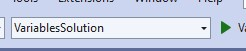

## Overview
In this lab, we will declare variables using the primitive (keyword) types and
initialize them with literal values.
We will then use ```Console.WriteLine()``` to display the values

| | |
| --------- | --------------------------- |
| Exercise Folder | Variables |
| Builds On | None |
| Time to complete | 30 minutes

---
## Instructions
1. Either create a new console application in your current solution or continue with your last project
1. In *Program.cs*, Declare variables of these types:
    - int, uint, long
    - float, double
    - char, bool
1. Initialize the variables with literals
1. Using interpolated strings ($"") and ```Console.WriteLine```, display the variable's values
 
 Note (Visual Studio):  If your solution has multiple projects, the *startup project* will execute when you run.  To select the startup project, look a the dropdown list in the toolbar:
 
 ---

 
