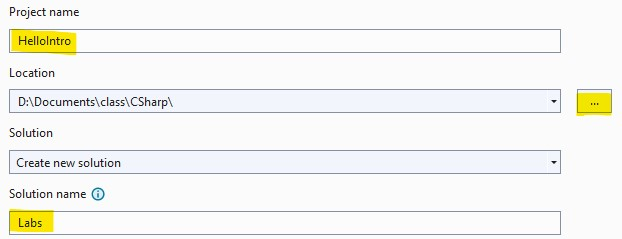

## Overview

Get acquainted with Visual Studio Testingprojects.Testing

| | |
| --- | ----- |
| Exercise Folder | VisualStudio 
| Builds On | None 
| Time to complete | 30 minutes

The instructor will guide you along creating and running a new application in both Visual Studio and VS Code.  Then, you can explore on your own!

---

### Visual Studio
1. Open Visual Studio
2. Create a new project 
3. Select the Console Application template 
4. Click Next
5. Name the project "HelloIntro" 
   1. Change the location if desired
   2. Change the solution name to *Labs*
6. Click *Next*
7. Choose *.NET 9.0* as the target framework
   1. if you don't see *.NET 9.0* in the list, cancel and see the instructions for installing the .NET 9.0 SDK below.
8. Click *Create*

### VS Code
1. Open VS Code
2. Open a folder where you want to create your project
3. Open a terminal window in VS Code
4. Create a new console application using the .NET CLI
   1. `dotnet new console -o HelloIntro`
   2. `-o` specifies the output directory
5. There are several ways to run a project in VS Code
   1. `dotnet run` from the terminal window
   2. `dotnet run` from the VS Code command palette
   3. `F5` to run the project in debug mode
   4. `Ctrl+F5` to run the project without debugging
   5. In the solution explorer, right-click the project and select *Run* or *Debug*  

### On your own:
1. Create a new C# Console application
2. Change the "Hello World" text to any other content
3. Run the application in VS
4. Locate the output directory for your program
5. Open a console window (cmd) in that folder
6. Execute the program from the command shell

### Installing the .NET 9.0 SDK
1. Open a browser and navigate to https://dotnet.microsoft.com/download/dotnet/9.0
2. Follow the instructions to install the SDK on your platform.